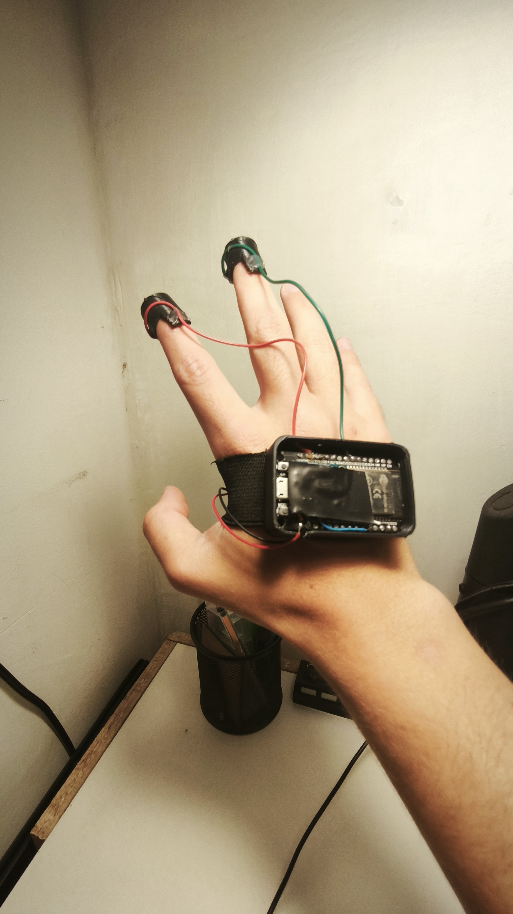
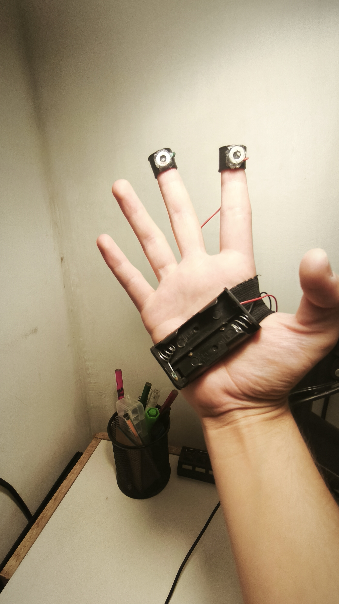
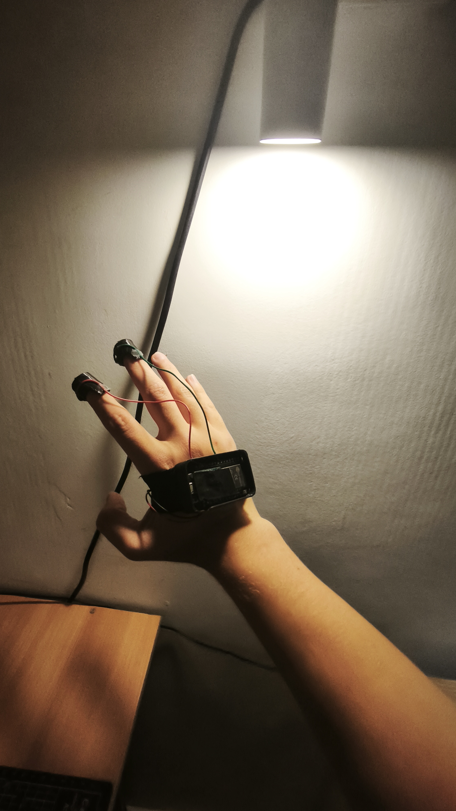

# Hand-Motion-Controller---HMC

## Description / Descripción
- This controller allows robots to be controlled intuitively, focusing on operator freedom and enabling the robot to be used as an extension of the body.  
- It contains up to four channels (one for each finger) through which four positions (left-right / forward-backward) can be transmitted.  

- Este controlador permite controlar robots de manera intuitiva, concentrándose en la libertad para el operador y permitiendo usar el robot como una extensión de su cuerpo.  
- Contiene hasta cuatro canales (uno por cada dedo) a través de los cuales se pueden transmitir cuatro posiciones (left-right / forward-backward).  

## Images / Imágenes

  
  

## Components / Componentes
- ESP32  
- MPU6050  
- Battery pack (AAA)  

## Materials / Materiales
- PLA  
- Metal washers  

- PLA  
- Arandelas metálicas  

## Operation / Funcionamiento
- The operator must press a washer to activate the channel (ESP32 capacitive pin) and be able to transmit the four positions (left-right / forward-backward, LRFB) depending on how the hand is positioned. This results in a total of 16 channels considering combinations of movements and capacitive pins (finger detector).  

- El operador debe presionar una arandela para activar el canal (pin capacitivo del ESP32) y poder transmitir las cuatro posiciones (left-right / forward-backward, LRFB) dependiendo de cómo esté posicionada su mano. Esto suma un total de 16 canales considerando las combinaciones de movimientos y pines capacitivos (detector en el dedo).  

## Results / Resultados
- This allows intuitive control without the distraction of a traditional controller, providing greater freedom when using robots while in constant movement.  

- Esto permite controlar de manera intuitiva sin la distracción de un control tradicional y tener una mayor libertad al usar robots cuando se está en constante movimiento.
